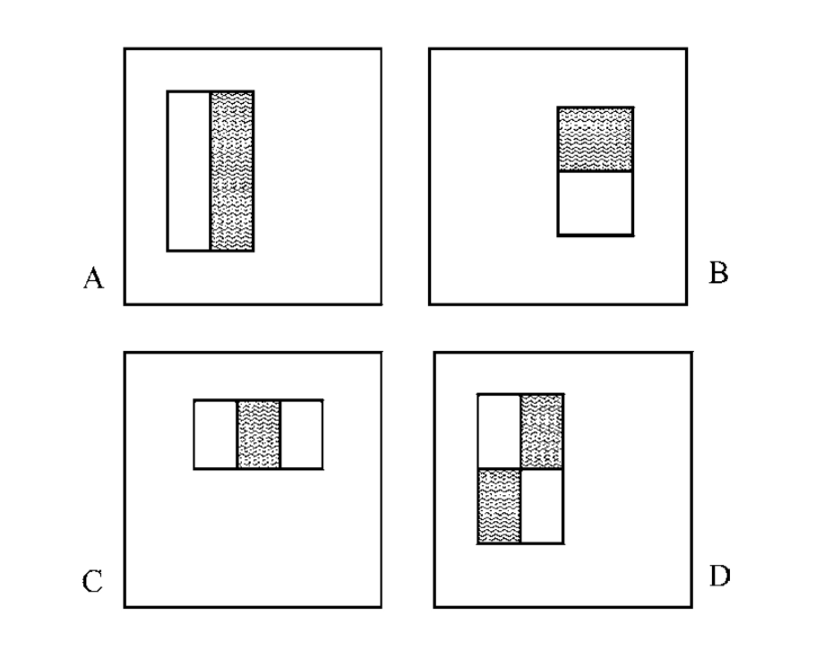
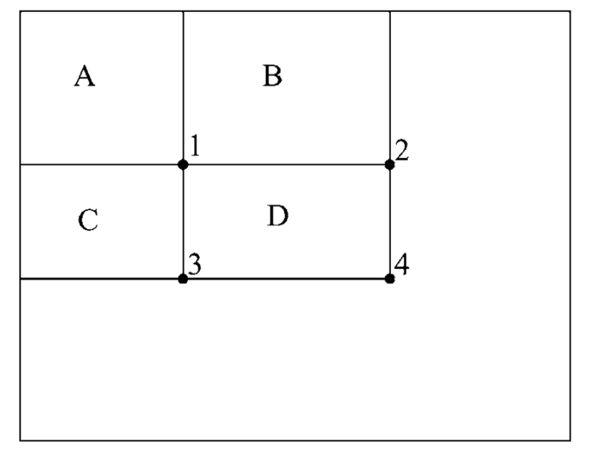
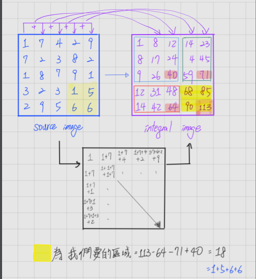
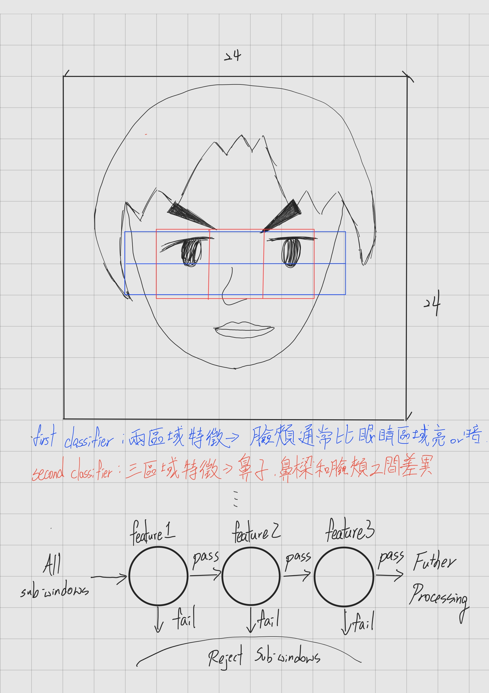

## Viola-Jones Algorithm
Viola-Jones Algorithm是為了達到快速辨識圖片物體檢測且有良率高的演算法，雖然可以訓練來尋找多種物體，但主要還是在解決人臉問題。<br>
在CNN成為主流的Image classification前，Viola-Jones已經廣泛使用了。<br>
CNN是用單一個分類器，看完完整圖像應用矩陣運算來做分類，而Viola-Jones是用多個不同的分類器，查看圖像的不同部分，Viola-Jones的單一個分類器精準度較低，容易產生更多的誤報，但當這些weak classifier 結果合併後，卻產生了一個強大的分類器<br>
由於算法性質，Viola-Jones竟用於二進制分類任務，訓練週期長，但單一分類器參數少，因此當有足夠數量的weak classifier時，發生分類錯誤率就會變很低，所以可以用來快速分類。<br>
## 功能

A,B是兩個矩陣特徵，C是三個矩陣特徵，D為四個矩陣特徵<br>
從陰影矩形中的像素總和中減去未陰影矩形中的像素總和。
由於算法要求迭代所有特徵，因此必須非常有效地計算它們。為了做到這一點，Viola 和 Jones 介紹了完整的形象。積分圖像由以下遞歸關係定義。<br><br>

<br><br>

s（x，y）是點（x，y）處的累積行總和，ii（x，y）是同一點處的積分圖像值，而i（x，y）是該點處的像素值。這種關係表示的是，在點（x，y）處的積分圖像是當前像素上方和左側所有像素的總和。如下所示，這使得計算矩形區域中的像素總和變得容易。

<br>


區域D中的像素之和為 ii(4)+ ii(1) - ii(2)- ii(3)，僅是四個陣列參考。讓我們通過創建一個輔助函數來開始實現該算法，該函數在給定圖像（表示為2D numpy數組）的情況下計算積分圖像。<br>

```python
import numpydef integral_image(image):
import numpy as np

    ii = np.zeros(image.shape)
    s = np.zeros(image.shape)
    for y in range(len(image)):
        for x in range(len(image[y])):
            s[y][x] = s[y-1][x] + image[y][x] if y-1 >= 0 else image[y][x]
            ii[y][x] = ii[y][x-1]+s[y][x] if x-1 >= 0 else s[y][x]
    return ii
```
此函數僅實現上面的遞歸關係。因為 s(x，-1)= 0，所以當 y-1 <0時，s(x，y) 就是 i(x，y)，同樣對於 ii(-1，y) 也是如此。接下來，讓我們定義一個幫助器類來存儲矩形區域，以便以後輕鬆計算要素的值。<br>
```python
class RectangleRegion:
    def __init__(self, x, y, width, height):
        self.x = x
        self.y = y
        self.width = width
        self.height = heightdef compute_feature(self, ii):
    return ii[self.y+self.height][self.x+self.width] + ii[self.y][self.x] - (ii[self.y+self.height][self.x]+ii[self.y][self.x+self.width])
```
## classifier權重
為了進行培訓，Viola-Jones使用了Adaboost的變體。提升的一般思路是讓每個後續的弱分類器更正先前分類器的錯誤。為此，它將權重分配給每個訓練示例，訓練分類器，選擇最佳分類器，並根據分類器的誤差更新權重。標註不正確的示例將獲得更大的權重，因此它們將被選擇的下一個分類器正確分類。<br>
<br>
<br>

## 初始化權重
在算法開始時，我們沒有任何錯誤可作為權重的基礎，因此，同一類別的每個訓練示例的權重都相同<br>
<br>

## weak classifier
我們終於有了所有的內容來開始構建和訓練弱分類器。回想一下，Viola-Jones使用一系列弱分類器並將它們的結果加權在一起以產生最終分類。每個弱分類器都是“弱”分類器，因為它本身不能準確地完成分類任務。每個弱分類器都查看單個特徵（f）。它具有閾值（θ）和極性（p）來確定訓練示例的分類。<br>
<br>
極性可以是-1或1。當p = 1時，當f（x）< θ或特徵值小於 threshold 時，弱分類器輸出正結果。當p = -1時，當f（x）> θ時，弱分類器輸出正結果。<br>

## 訓練弱分類器
訓練弱分類器是該算法中計算量最大的部分，因為每次選擇新的弱分類器作為最佳分類器時，由於訓練示例的權重不同，因此必須重新訓練所有分類器。但是，存在一種使用權重為單個弱分類器找到最佳閾值和極性的有效方法。首先，根據權重對應的特徵值對權重進行排序。現在，遍歷權重數組，如果選擇閾值作為該特徵，則計算誤差。找到誤差最小的閾值和極性。閾值的可能值是每個訓練示例上特徵的值。誤差可以通過訓練弱分類器是該算法中計算量最大的部分，因為每次選擇新的弱分類器作為最佳分類器時，由於訓練示例的權重不同，因此必須重新訓練所有分類器。但是，存在一種使用權重為單個弱分類器找到最佳閾值和極性的有效方法。首先，根據權重對應的特徵值對權重進行排序。現在，遍歷權重數組，如果選擇閾值作為該特徵，則計算誤差。找到誤差最小的閾值和極性。閾值的可能值是每個訓練示例上特徵的值。誤差可以通過<br>
<br>
T表示權重的總和，S表示到目前為止所看到的所有示例的權重之和。上標“ +”和“-”表示總和屬於哪一類。從概念上講，此錯誤比較瞭如果將當前位置以下的所有示例都標記為否，則有多少示例將被錯誤分類；如果將當前位置下方的所有示例都標記為正，則將有多少示例將被錯誤分類（考慮到每個示例的加權方式） 。

## 選擇最佳弱分類器

## 更新權重

#### 資料來源
[paper](https://www.cs.cmu.edu/~efros/courses/LBMV07/Papers/viola-cvpr-01.pdf)<br>
[pdf](https://www.cs.ubc.ca/~lowe/425/slides/13-ViolaJones.pdf)<br>
[wiki](https://en.wikipedia.org/wiki/Viola%E2%80%93Jones_object_detection_framework)<br>
