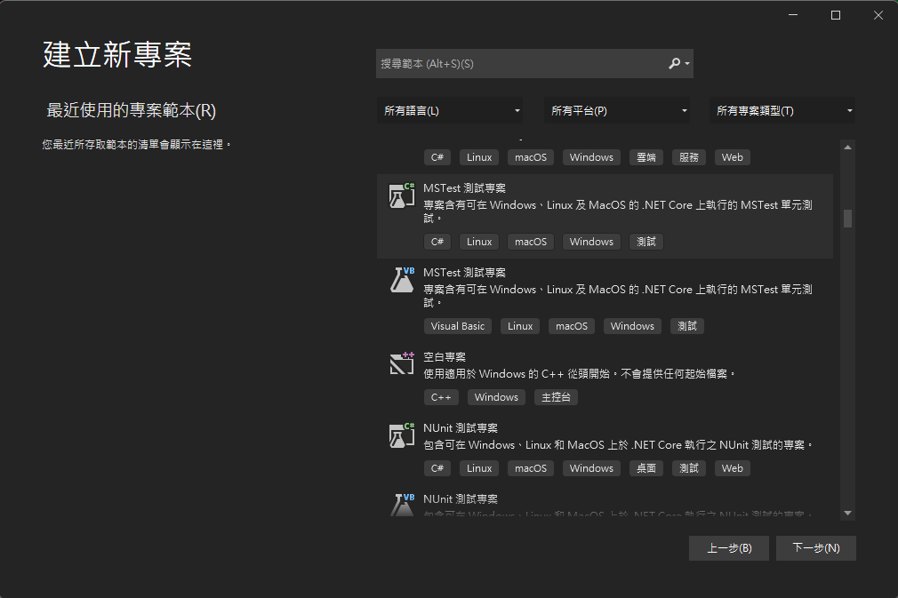
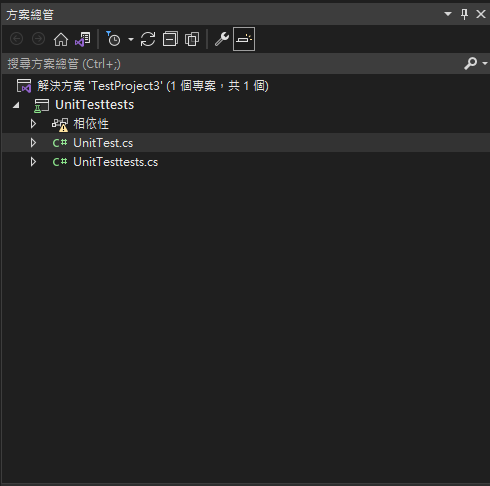
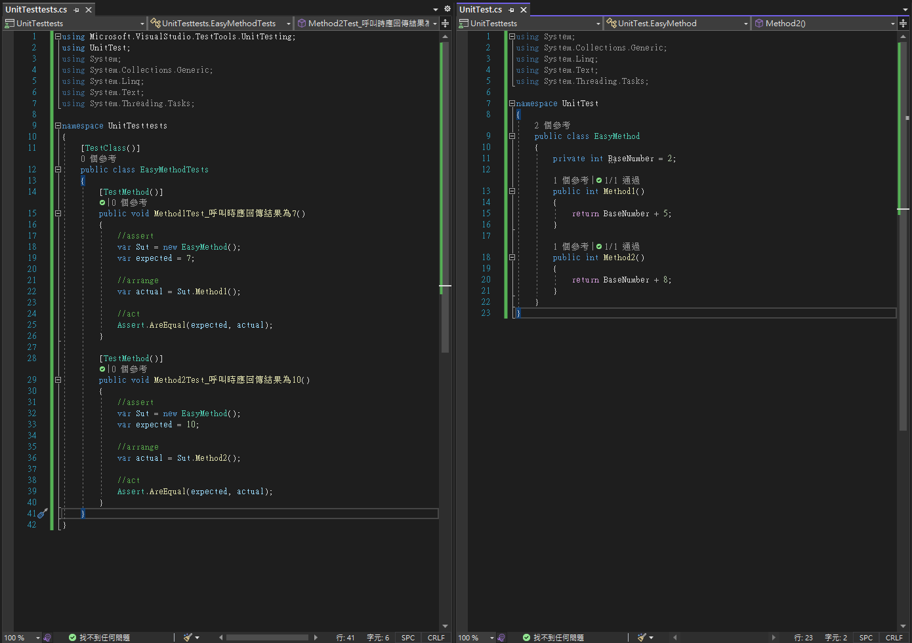
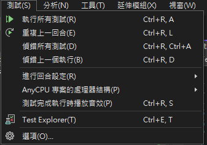
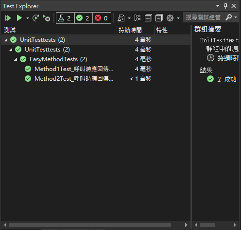

# Unit test in vs
- step 1 : make project 
 

- step 2 : create a new projetc  
 

- step 3 : edit testing project and tested project 
 

- step 4 : open test explorer 
 

- step 5 : click the execute  
 
