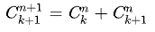

# WEEK2 
## 查表法
由上個禮拜BigO的探討，我們知道將coding由繁化簡是件佳事，但要如何做到由繁化簡呢，這裡介紹一個方式:**查表法**
 ## 費氏數列 
- [費氏數列](./homework/alg/fibonacci.md)
由此可知要對電腦來說計算費氏數列的複雜難度成指數成長，一旦數字一大，對電腦的負載量就會極大，範例:

```=
function fibonacci (n) {
  if (n < 0) throw Error('fibonacci:n < 0')
  if (n === 0) return 0
  if (n === 1) return 1
  return fibonacci(n - 1) + fibonacci(n - 2)
}

var startTime = Date.now()
const n = 45
console.log(`fibonacci(${n})=${fibonacci(n)}`)
var endTime = Date.now()
var milliSeconds = endTime - startTime
console.log(`time:${milliSeconds}ms`)
```
**BigO = n^2**
```
sky@MSI MINGW64 ~/Desktop/VSCode  (GITHUB)/軟體工程演算法/sa/alg/01-tableLookup/fiboanacci (master)
$ deno run fibonacci.js 
fibonacci(45)=1134903170
time:14000ms
```
<br>

- 因此我們利用了像查字典的方式，利用了JS的物件，讓他記憶後，之後直接輸出即可，不用多作運算，這樣速度就快很多，範例:
```=
var fib = [0, 1]

function fibonacci (n) {
  if (n < 0) throw Error('fibonacci:n < 0')
  //往array尋找，若查的到，直接傳回，減少運算次數，BigO = n
  if (fib[n] != null) return fib[n] 
  fib[n] = fibonacci(n - 1) + fibonacci(n - 2)
  return fib[n]
}

var startTime = Date.now()
const n = 45
console.log(`fibonacci(${n})=${fibonacci(n)}`)
console.log('fib[]=', fib)
var endTime = Date.now()
var milliSeconds = endTime - startTime
console.log(`time:${milliSeconds}ms`)
```
**BigO = n**
```
sky@MSI MINGW64 ~/Desktop/VSCode  (GITHUB)/軟體工程演算法/sa/alg/01-tableLookup/fiboanacci (master)
$ deno run fibonacci_lookup.js 
fibonacci(45)=1134903170
fib[]= [
          0,          1,         1,         2,
          3,          5,         8,        13,
         21,         34,        55,        89,
        144,        233,       377,       610,
        987,       1597,      2584,      4181,
       6765,      10946,     17711,     28657,
      46368,      75025,    121393,    196418,
     317811,     514229,    832040,   1346269,
    2178309,    3524578,   5702887,   9227465,
   14930352,   24157817,  39088169,  63245986,
  102334155,  165580141, 267914296, 433494437,
  701408733, 1134903170
]
time:5ms
```
這樣唯一的壞處是輸出超出數值範圍，JS是使用雙經度的浮點數做表示，數字小的時候還能精準表示，一但數值變大時，數值就會產生漏洞
<br>

- 這裡再介紹一個迴圈版的fibonacci計算，速度會更快(~~呼叫跟查表還是需要時間嘛~~)，但也相對更難理解，範例:
```=
function fibonacci (n) {
  if (n===0) return 0
  if (n===1) return 1
  // f(0)=0, f(1)=1
  var fi2 = 0, fi1 = 1 
  // fi2 = f(n-2), fi1 = f(n-1)
  for (var i=2; i<=n; i++) {
    var fi = fi1+fi2
    fi2 = fi1
    fi1 = fi
  }
  return fi
}

var startTime = Date.now()
const n = 45
console.log(`fibonacci(${n})=${fibonacci(n)}`)
var endTime = Date.now()
var milliSeconds = endTime - startTime
console.log(`time:${milliSeconds}ms`)
```
**BigO = n**
```
sky@MSI MINGW64 ~/Desktop/VSCode  (GITHUB)/軟體工程演算法/sa/alg/01-tableLookup/fiboanacci (master)
$ deno run fibonacci_loop.js 
fibonacci(45)=1134903170
time:1ms
```

## 巴斯卡三角形
- [巴斯卡三角形](https://zh.wikipedia.org/wiki/%E6%9D%A8%E8%BE%89%E4%B8%89%E8%A7%92%E5%BD%A2)
- 巴斯卡恆等式:<br>
我們這次換成排列組合，這裡為範例:
```=
function c(n, k) {
  if (k==0 || k==n) return 1
  //數學計算
  return c(n-1, k) + c(n-1, k-1)
}

console.log("c(5,2)=", c(5,2))
console.log("c(7,3)=", c(7,3))
console.log("c(12,5)=", c(12,5))
console.log("c(60,30)=", c(60,30))
```
**BigO = 2^n**
```
sky@MSI MINGW64 ~/Desktop/VSCode  (GITHUB)/軟體工程演算法/sa/alg/01-tableLookup/combinatorial (master)
$ deno run CnkR.js 
c(5,2)= 10
c(7,3)= 35  
c(12,5)= 792

```
這裡看到C60取30已經運算不出來了，複雜度太高了。
- 再次使用查表法，範例:
```=
//C為一個陣列
var C = []

function c(n, k) {
  //空陣列設定
  if (C[n] == null) C[n] = []
  //查表輸出
  if (C[n][k] != null) return C[n][k]
  if (k==0 || k==n)
    C[n][k] = 1
    //若上面都沒成立，進行運算
  else 
    C[n][k] = c(n-1,k) + c(n-1, k-1)
    //回傳陣列
  return C[n][k]
}

console.log("c(5,2)=", c(5,2))
console.log("C=", C);
console.log("c(7,3)=", c(7,3))
console.log("c(12,5)=", c(12,5))
console.log("c(60,30)=", c(60,30))

/*
https://en.wikipedia.org/wiki/Binomial_coefficient

def binomialCoefficient(n, k):
    if k < 0 or k > n:
        return 0
    if k > n - k: # take advantage of symmetry
        k = n - k
    if k == 0 or n <= 1:
    	return 1
    return binomialCoefficient(n-1, k) + binomialCoefficient(n-1, k-1)
*/
```
```
sky@MSI MINGW64 ~/Desktop/VSCode  (GITHUB)/軟體工程演算法/sa/alg/01-tableLookup/combinatorial (master)
$ deno run CnkRLookup.js 
c(5,2)= 10
C= [
  <1 empty item>,
  [ 1, 1 ],
  [ 1, 2, 1 ],
  [ 1, 3, 3 ],
  [ <1 empty item>, 4, 6 ],
  [ <2 empty items>, 10 ]  
]
c(7,3)= 35
c(12,5)= 792
c(60,30)= 118264581564861420
```
- 使用迴圈，範例:

```=
function factorial(n) {
  var p = 1
  for (let i=1; i<=n; i++) {
    p = p * i;
  }
  return p
}

function c(n, k) {
  return factorial(n) / (factorial(k)*factorial(n-k))
}

console.log("c(5,2)=", c(5,2))
console.log("c(7,3)=", c(7,3))
console.log("c(12,5)=", c(12,5))
console.log("c(60,30)=", c(60,30))
```
```
$ deno run Cnk.js 
c(5,2)= 10
c(7,3)= 35
c(12,5)= 792
c(60,30)= 118264581564861470

```